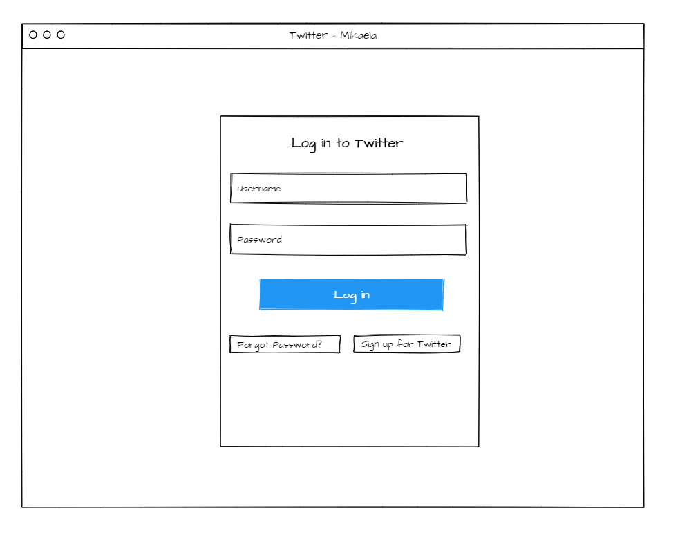
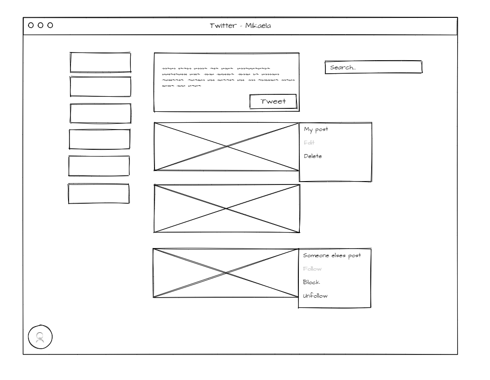

# Twitter Clone

A foundational application that mimics Twitter

## Installation

Ensure node.js and git are installed.

Clone this repo:
```
git clone https://github.com/Mikaela95/twitter-clone.git
cd twitter-clone/client
```
### Frontend

Install the dependencies:

```
npm install
```


Start the app
```
npm run start
```
This will run the application on port 3000

### Backend

*Future work - migrate PostgreSQL to an Amazon Relational Database Service (Amazon RDS) or DynamoDB*
## Motivation

To develop my skills building relational databases, and explore incorporating TypeGraphQL, Apollo-server/client and TypeORM.

## User Stories

As a user I can…

*	Create an account with a unique username and password,
*	See validation errors for when a username has already been taken and when the username or password is incorrectly typed.
*	Be redirected to the home page upon successful login.
*	See previous posts created under my username,
*	Input text into a form and create this as a tweet,
*	See the latest changes of my tweet appear directly beneath the input box,
*	Delete a tweet and have that removed from the list of tweets displayed,
*	Edit a tweet, either through a modal window or separate page, and see these changes displayed in the list.

## Wireframes

Login/Signup Page



Landing Page


## Built With
Frontend:
<br>
* React + Typescript
* Apollo-Client

<br>
Backend:

* PostgreSQL
* TypeORM
* Type-GraphQL
* Apollo-Server

## Further work

* Associate users with tweets,
* Create a user profile to include the following: tweets, likes, people or groups followed.
* Display a curated list of tweets based on who the user follows
* Ability to add images/media/polls to the tweet

## License

This project is licensed under the MIT License - see the [LICENSE.md](LICENSE.md) file for details

## Acknowledgments

The awesome team at GA! 

* Ashish Kumar
* Pradosh Sinha
* Stacey Ryan
